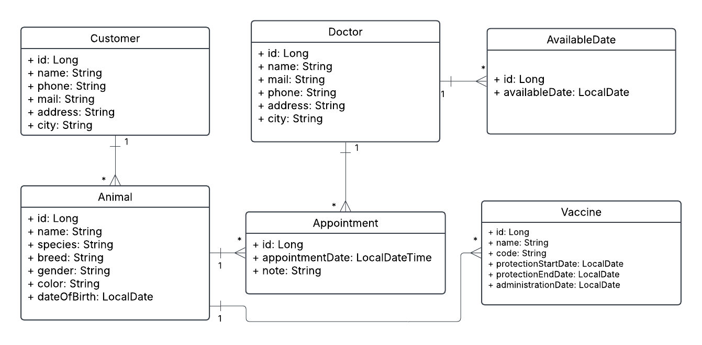

# 🐾 Veterinary Management System

Bu proje, veteriner kliniklerinde müşteri, hayvan, veteriner hekimi, randevu ve aşı işlemlerinin yönetimini sağlayan bir **Java Spring Boot** uygulamasıdır.

## 🔧 Kullanılan Teknolojiler

- Java 21
- Spring Boot
  - Spring Web
  - Spring Data JPA
- PostgreSQL
- Lombok
- Postman
- Maven

---

## 🗂️ Proje Yapısı

- `Customer`: Hayvan sahiplerinin bilgileri
- `Animal`: Müşterilere ait hayvanlar
- `Doctor`: Veteriner hekimler
- `AvailableDate`: Hekimlerin uygun oldukları günler
- `Appointment`: Hayvan-hasta için randevu oluşturma sistemi
- `Vaccine`: Hayvanlara uygulanan aşıların takibi

---

## ⚙️ Kurulum ve Çalıştırma

1. Projeyi klonlayın:
   ```bash
   git clone https://github.com/eneszeybek/veterinary-management-system.git
   cd veterinary-management-system
   ```

2. PostgreSQL veritabanınızı oluşturun:
   - Veritabanı adı: `vetapp`
   - Kullanıcı: `postgres`
   - Şifre: `1234`

3. `application.properties` içinde gerekli bağlantı bilgilerini kontrol edin.

4. Aşağıdaki komutla projeyi çalıştırın:
   ```bash
   ./mvnw spring-boot:run
   ```

---

## 📮 API Kullanımı

Tüm endpoint'ler `http://localhost:8080/api` altında sunulmaktadır.  
👉 [Postman koleksiyonu](./postman/VetApp.postman_collection.json) dosyasını kullanarak test edebilirsiniz.

### Örnek Endpoint'ler

- `POST /api/customers`
- `GET /api/animals/by-customer/{customerId}`
- `POST /api/vaccines/{animalId}`
- `GET /api/vaccines/protection-range?start=2025-12-01&end=2026-01-31`
- `POST /api/appointments/{doctorId}/{animalId}`

---

## 🛡️ Aşı Kısıtlaması

Bir hayvana ait aynı aşı (aynı ad ve kod) koruyuculuğu hala devam ediyorsa, sistem aynı aşıyı tekrar kaydetmeye izin vermez.  

---

## 📊 UML Diyagramı

Aşağıda sistemin genel UML diyagramı yer almaktadır:



---

## 📁 Ek Dosyalar

- `docs/uml.png`: UML sınıf diyagramı
- `postman/VetApp.postman_collection.json`: Postman API koleksiyonu
- `backup/vetapp_backup.sql`: PostgreSQL yedek dosyası

---

## 👩‍💻 Geliştirici

- Enes Zeybek – [GitHub](https://github.com/eneszeybek)
